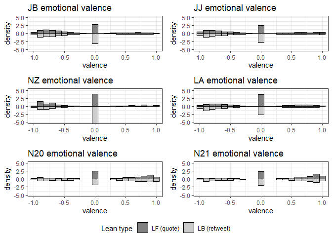
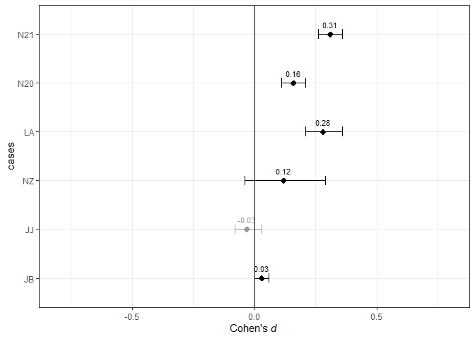
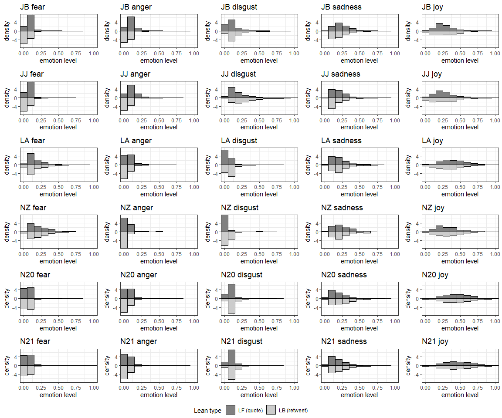
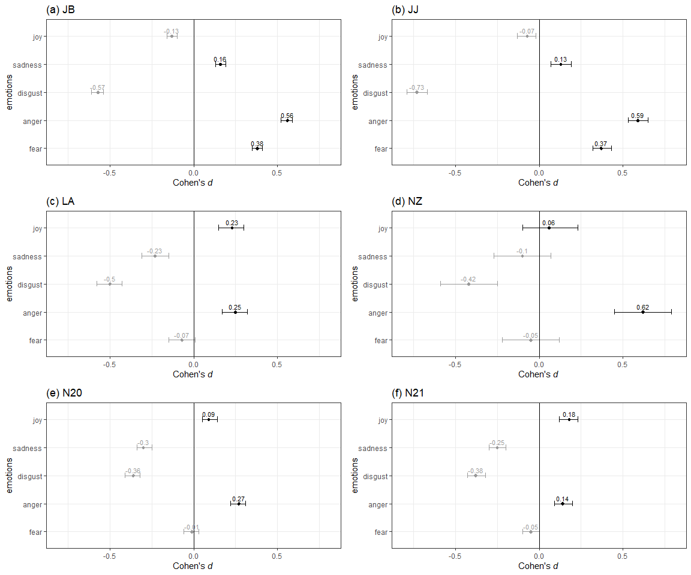

### 1) Import data

Importing the data for the analysis

``` r
#library here uses the base of the R-project as initial directory
#JB stands for Judge Barrett
case_JB <- read.csv(here::here("data", "JudgeBarrettRTQT_R.csv"), header = TRUE)

#JJ stands for Judge Jackson
case_JJ <- read.csv(here::here("data", "JudgeJacksonRTQT_R.csv"), header = TRUE)

#LA stands for LA earthquake
case_LA <- read.csv(here::here("data", "LAearthquakeRTQT_R.csv"), header = TRUE)

#NZ stands for New Zealand earthquake
case_NZ <- read.csv(here::here("data", "NZearthquakeRTQT_R.csv"), header = TRUE)

#N20 stands for NBA 2020 finals
case_N20 <- read.csv(here::here("data", "NBAFinals20RTQT_R.csv"), header = TRUE)

#N21 stands for NBA 2021 finals
case_N21 <- read.csv(here::here("data", "NBAFinals21RTQT_R.csv"), header = TRUE)
```

### 2) Functions for the analysis

Import the set of functions used for the analysis from R script
“functions_1.R”

``` r
sys.source(here::here("scripts", "functions", "functions_1.R"), envir = knitr::knit_global())
```

### 3) Sentiment analysis

#### 3.1) Judge Barrett case

This analysis contains descriptive statistics, t-test, and effect sizes
comparisons for the valence of lean-back and lean-forward tweets.

``` r
#Histogram
valence_JB <- create.valence.plot(case_JB, plot_title = "JB emotional valence")
```

    ## 
    ## Attaching package: 'dplyr'

    ## The following objects are masked from 'package:stats':
    ## 
    ##     filter, lag

    ## The following objects are masked from 'package:base':
    ## 
    ##     intersect, setdiff, setequal, union

``` r
#Descriptive statistics
psych::describeBy(case_JB$sent_score, case_JB$referenced_tweets_type)
```

    ## 
    ##  Descriptive statistics by group 
    ## group: quoted
    ##    vars    n  mean   sd median trimmed  mad min max range skew kurtosis   se
    ## X1    1 5414 -0.25 0.55  -0.33   -0.29 0.52  -1   1     2 0.52    -0.79 0.01
    ## ------------------------------------------------------------ 
    ## group: retweeted
    ##    vars     n  mean   sd median trimmed  mad min max range skew kurtosis se
    ## X1    1 17814 -0.26 0.54  -0.35   -0.31 0.52  -1   1     2 0.54    -0.67  0

``` r
#Test the difference in valence
t.test(data = case_JB, sent_score ~ referenced_tweets_type)
```

    ## 
    ##  Welch Two Sample t-test
    ## 
    ## data:  sent_score by referenced_tweets_type
    ## t = 2.177, df = 8731.5, p-value = 0.02951
    ## alternative hypothesis: true difference in means between group quoted and group retweeted is not equal to 0
    ## 95 percent confidence interval:
    ##  0.001846413 0.035241461
    ## sample estimates:
    ##    mean in group quoted mean in group retweeted 
    ##              -0.2464338              -0.2649778

``` r
#Effect size Cohen's d
cn_va_JB <- effectsize::cohens_d(case_JB[which(case_JB$referenced_tweets_type != 'retweeted'), "sent_score"],
                                 case_JB[which(case_JB$referenced_tweets_type == 'retweeted'), "sent_score"])
cn_va_JB
```

    ## Cohen's d |       95% CI
    ## ------------------------
    ## 0.03      | [0.00, 0.06]
    ## 
    ## - Estimated using pooled SD.

#### 3.2) Judge Jackson case

This analysis contains descriptive statistics, t-test, and effect sizes
comparisons for the valence of lean-back and lean-forward tweets.

``` r
#Histogram
valence_JJ <- create.valence.plot(case_JJ, plot_title = "JJ emotional valence")

#Descriptive statistics
psych::describeBy(case_JJ$sent_score, case_JJ$referenced_tweets_type)
```

    ## 
    ##  Descriptive statistics by group 
    ## group: quoted
    ##    vars    n  mean  sd median trimmed  mad min max range skew kurtosis   se
    ## X1    1 1770 -0.21 0.6  -0.32   -0.25 0.65  -1   1     2 0.47       -1 0.01
    ## ------------------------------------------------------------ 
    ## group: retweeted
    ##    vars    n  mean  sd median trimmed mad min max range skew kurtosis   se
    ## X1    1 3991 -0.19 0.6      0   -0.23 0.9  -1   1     2  0.4    -1.03 0.01

``` r
#Test the difference in 
t.test(data = case_JJ, sent_score ~ referenced_tweets_type)
```

    ## 
    ##  Welch Two Sample t-test
    ## 
    ## data:  sent_score by referenced_tweets_type
    ## t = -0.95749, df = 3356.1, p-value = 0.3384
    ## alternative hypothesis: true difference in means between group quoted and group retweeted is not equal to 0
    ## 95 percent confidence interval:
    ##  -0.05020277  0.01725836
    ## sample estimates:
    ##    mean in group quoted mean in group retweeted 
    ##              -0.2089288              -0.1924566

``` r
#Effect size Cohen's d
cn_va_JJ <- effectsize::cohens_d(case_JJ[which(case_JJ$referenced_tweets_type != 'retweeted'), "sent_score"],
                                 case_JJ[which(case_JJ$referenced_tweets_type == 'retweeted'), "sent_score"])
cn_va_JJ
```

    ## Cohen's d |        95% CI
    ## -------------------------
    ## -0.03     | [-0.08, 0.03]
    ## 
    ## - Estimated using pooled SD.

#### 3.3) LA earthquake case

This analysis contains descriptive statistics, t-test, and effect sizes
comparisons for the valence of lean-back and lean-forward tweets.

``` r
#Histogram
valence_LA <- create.valence.plot(case_LA, plot_title = "LA emotional valence")

#Descriptive statistics
psych::describeBy(case_LA$sent_score, case_LA$referenced_tweets_type)
```

    ## 
    ##  Descriptive statistics by group 
    ## group: quoted
    ##    vars   n  mean   sd median trimmed  mad min  max range skew kurtosis   se
    ## X1    1 865 -0.11 0.56      0   -0.13 0.77  -1 0.99  1.99 0.17    -0.97 0.02
    ## ------------------------------------------------------------ 
    ## group: retweeted
    ##    vars    n  mean   sd median trimmed  mad min  max range skew kurtosis   se
    ## X1    1 2699 -0.27 0.58  -0.42   -0.32 0.62  -1 0.99  1.99 0.49    -0.96 0.01

``` r
#Test the difference in 
t.test(data = case_LA, sent_score ~ referenced_tweets_type)
```

    ## 
    ##  Welch Two Sample t-test
    ## 
    ## data:  sent_score by referenced_tweets_type
    ## t = 7.3844, df = 1502.8, p-value = 2.526e-13
    ## alternative hypothesis: true difference in means between group quoted and group retweeted is not equal to 0
    ## 95 percent confidence interval:
    ##  0.1189466 0.2049966
    ## sample estimates:
    ##    mean in group quoted mean in group retweeted 
    ##              -0.1097776              -0.2717493

``` r
#Effect size Cohen's d
cn_va_LA <- effectsize::cohens_d(case_LA[which(case_LA$referenced_tweets_type != 'retweeted'), "sent_score"],
                                 case_LA[which(case_LA$referenced_tweets_type == 'retweeted'), "sent_score"])
cn_va_LA
```

    ## Cohen's d |       95% CI
    ## ------------------------
    ## 0.28      | [0.21, 0.36]
    ## 
    ## - Estimated using pooled SD.

#### 3.4) NZ earthquake case

This analysis contains descriptive statistics, t-test, and effect sizes
comparisons for the valence of lean-back and lean-forward tweets.

``` r
#Histogram
valence_NZ <- create.valence.plot(case_NZ, plot_title = "NZ emotional valence")

#Descriptive statistics
psych::describeBy(case_NZ$sent_score, case_NZ$referenced_tweets_type)
```

    ## 
    ##  Descriptive statistics by group 
    ## group: quoted
    ##    vars   n mean   sd median trimmed  mad   min  max range skew kurtosis   se
    ## X1    1 160 -0.2 0.56      0   -0.24 0.86 -0.97 0.99  1.96 0.35    -0.89 0.04
    ## ------------------------------------------------------------ 
    ## group: retweeted
    ##    vars   n  mean   sd median trimmed mad   min max range skew kurtosis   se
    ## X1    1 979 -0.26 0.44      0   -0.26   0 -0.98   1  1.97 0.01     -0.6 0.01

``` r
#Test the difference in 
t.test(data = case_NZ, sent_score ~ referenced_tweets_type)
```

    ## 
    ##  Welch Two Sample t-test
    ## 
    ## data:  sent_score by referenced_tweets_type
    ## t = 1.2168, df = 192.67, p-value = 0.2252
    ## alternative hypothesis: true difference in means between group quoted and group retweeted is not equal to 0
    ## 95 percent confidence interval:
    ##  -0.03520573  0.14861228
    ## sample estimates:
    ##    mean in group quoted mean in group retweeted 
    ##              -0.2003524              -0.2570557

``` r
#Effect size Cohen's d
cn_va_NZ <- effectsize::cohens_d(case_NZ[which(case_NZ$referenced_tweets_type != 'retweeted'), "sent_score"],
                                 case_NZ[which(case_NZ$referenced_tweets_type == 'retweeted'), "sent_score"])
cn_va_NZ
```

    ## Cohen's d |        95% CI
    ## -------------------------
    ## 0.12      | [-0.04, 0.29]
    ## 
    ## - Estimated using pooled SD.

#### 3.5) NBA 2020 finals case

This analysis contains descriptive statistics, t-test, and effect sizes
comparisons for the valence of lean-back and lean-forward tweets.

``` r
#Histogram
valence_N20 <- create.valence.plot(case_N20, plot_title = "N20 emotional valence")

#Descriptive statistics
psych::describeBy(case_N20$sent_score, case_N20$referenced_tweets_type)
```

    ## 
    ##  Descriptive statistics by group 
    ## group: quoted
    ##    vars    n mean   sd median trimmed  mad   min max range  skew kurtosis   se
    ## X1    1 2740 0.24 0.61   0.36    0.28 0.63 -0.99   1  1.99 -0.46    -1.06 0.01
    ## ------------------------------------------------------------ 
    ## group: retweeted
    ##    vars    n mean   sd median trimmed  mad min max range  skew kurtosis   se
    ## X1    1 5254 0.13 0.64      0    0.16 0.96  -1   1     2 -0.26    -1.38 0.01

``` r
#Test the difference in 
t.test(data = case_N20, sent_score ~ referenced_tweets_type)
```

    ## 
    ##  Welch Two Sample t-test
    ## 
    ## data:  sent_score by referenced_tweets_type
    ## t = 6.9143, df = 5800.4, p-value = 5.208e-12
    ## alternative hypothesis: true difference in means between group quoted and group retweeted is not equal to 0
    ## 95 percent confidence interval:
    ##  0.07269359 0.13022659
    ## sample estimates:
    ##    mean in group quoted mean in group retweeted 
    ##               0.2350371               0.1335770

``` r
#Effect size Cohen's d
cn_va_N20 <- effectsize::cohens_d(case_N20[which(case_N20$referenced_tweets_type != 'retweeted'), "sent_score"],
                                  case_N20[which(case_N20$referenced_tweets_type == 'retweeted'), "sent_score"])
cn_va_N20
```

    ## Cohen's d |       95% CI
    ## ------------------------
    ## 0.16      | [0.11, 0.21]
    ## 
    ## - Estimated using pooled SD.

#### 3.6) NBA 2021 finals case

This analysis contains descriptive statistics, t-test, and effect sizes
comparisons for the valence of lean-back and lean-forward tweets.

``` r
#Histogram
valence_N21 <- create.valence.plot(case_N21, plot_title = "N21 emotional valence")

#Descriptive statistics
psych::describeBy(case_N21$sent_score, case_N21$referenced_tweets_type)
```

    ## 
    ##  Descriptive statistics by group 
    ## group: quoted
    ##    vars    n mean   sd median trimmed mad min max range  skew kurtosis   se
    ## X1    1 2068 0.29 0.61   0.49    0.35 0.7  -1   1     2 -0.59    -0.91 0.01
    ## ------------------------------------------------------------ 
    ## group: retweeted
    ##    vars    n mean   sd median trimmed  mad min max range skew kurtosis   se
    ## X1    1 4377  0.1 0.66      0    0.11 0.97  -1   1     2 -0.2    -1.39 0.01

``` r
#Test the difference in 
t.test(data = case_N21, sent_score ~ referenced_tweets_type)
```

    ## 
    ##  Welch Two Sample t-test
    ## 
    ## data:  sent_score by referenced_tweets_type
    ## t = 11.915, df = 4367, p-value < 2.2e-16
    ## alternative hypothesis: true difference in means between group quoted and group retweeted is not equal to 0
    ## 95 percent confidence interval:
    ##  0.1654645 0.2306416
    ## sample estimates:
    ##    mean in group quoted mean in group retweeted 
    ##              0.29346056              0.09540753

``` r
#Effect size Cohen's d
cn_va_N21 <- effectsize::cohens_d(case_N21[which(case_N21$referenced_tweets_type != 'retweeted'), "sent_score"],
                                  case_N21[which(case_N21$referenced_tweets_type == 'retweeted'), "sent_score"])
cn_va_N21
```

    ## Cohen's d |       95% CI
    ## ------------------------
    ## 0.31      | [0.26, 0.36]
    ## 
    ## - Estimated using pooled SD.

#### 3.7) Figure SM 1: Distribution of emotional valence

Figure with the distribution of valence for lean-back and lean-forward
tweets in each case.

``` r
#Plot of the five emotions
library(ggpubr)

ggarrange(valence_JB, valence_JJ, 
          valence_NZ, valence_LA,
          valence_N20, valence_N21,
          ncol = 2, nrow = 3, common.legend = TRUE, legend="bottom")
```

    ## Warning: The dot-dot notation (`..density..`) was deprecated in ggplot2 3.4.0.
    ## ℹ Please use `after_stat(density)` instead.
    ## This warning is displayed once every 8 hours.
    ## Call `lifecycle::last_lifecycle_warnings()` to see where this warning was
    ## generated.

<!-- -->

#### 3.8) Manuscript Figure 2: Cohen’s d effect sizes for analysis of valence

``` r
valence <- c(cn_va_JB$Cohens_d, cn_va_JJ$Cohens_d, cn_va_NZ$Cohens_d, #careful here with the order
             cn_va_LA$Cohens_d, cn_va_N20$Cohens_d, cn_va_N21$Cohens_d)

val_low <- c(cn_va_JB$CI_low, cn_va_JJ$CI_low, cn_va_NZ$CI_low, #careful here with the order
             cn_va_LA$CI_low, cn_va_N20$CI_low, cn_va_N21$CI_low)

val_high <- c(cn_va_JB$CI_high, cn_va_JJ$CI_high, cn_va_NZ$CI_high, #careful here with the order
              cn_va_LA$CI_high, cn_va_N20$CI_high, cn_va_N21$CI_high)

cases <- c('JB', 'JJ', 'NZ', 'LA', 'N20', 'N21')


pos_neg <- valence > 0


val_cohens <- data.frame(cases, valence, pos_neg, val_low, val_high)
val_cohens$valence <- round(as.numeric(val_cohens$valence), digits = 2)
val_cohens$val_low <- round(as.numeric(val_cohens$val_low), digits = 2)
val_cohens$val_high <- round(as.numeric(val_cohens$val_high), digits = 2)

#Definition of the order to plot stages and emotions
val_cohens$cases <- factor(val_cohens$cases, levels=c('JB', 'JJ', 'NZ', 'LA', 'N20', 'N21'))

ggplot(val_cohens, aes(x = valence, y = cases, color = pos_neg, label = valence)) +
  #geom_segment(aes(x = 0, xend = valence, yend = cases), lty=2) +
  geom_point(shape=18, size=3) +
  geom_errorbar(aes(xmin=val_low, xmax=val_high), width=.2) +
  geom_vline(xintercept = 0) +
  geom_text(nudge_y = 0.2, size = 3) +
  guides(color='none') +
  scale_colour_manual(values = c('gray60', 'black')) +
  xlim(-0.8, 0.8) +
  labs(x = expression(paste("Cohen's ", italic("d ")))) +
  theme_bw()
```

<!-- -->

### 4) Emotions analysis

#### 4.1) Judge Barrett case

This analysis contains descriptive statistics, t-test, and effect sizes
comparisons for the emotions of lean-back and lean-forward tweets.

``` r
#Emotions distribution plots
fear_JB <- create.emotion.plot(case_JB, emotion = "fear", plot_title = "JB fear")
```

    ## Warning: `aes_string()` was deprecated in ggplot2 3.0.0.
    ## ℹ Please use tidy evaluation idioms with `aes()`.
    ## ℹ See also `vignette("ggplot2-in-packages")` for more information.
    ## This warning is displayed once every 8 hours.
    ## Call `lifecycle::last_lifecycle_warnings()` to see where this warning was
    ## generated.

``` r
anger_JB <- create.emotion.plot(case_JB, emotion = "anger", plot_title = "JB anger")

disgust_JB <- create.emotion.plot(case_JB, emotion = "disgust", plot_title = "JB disgust")

sadness_JB <- create.emotion.plot(case_JB, emotion = "sadness", plot_title = "JB sadness")

joy_JB <- create.emotion.plot(case_JB, emotion = "joy", plot_title = "JB joy")

#Descriptive statistics
psych::describeBy(case_JB[10:14], case_JB$referenced_tweets_type)
```

    ## 
    ##  Descriptive statistics by group 
    ## group: quoted
    ##         vars    n mean   sd median trimmed  mad  min  max range skew kurtosis
    ## sadness    1 5414 0.24 0.11   0.22    0.23 0.10 0.02 0.85  0.84 1.12     1.64
    ## joy        2 5414 0.27 0.15   0.25    0.26 0.12 0.00 0.99  0.99 1.14     2.06
    ## fear       3 5414 0.08 0.05   0.07    0.07 0.03 0.00 0.61  0.60 3.13    16.19
    ## disgust    4 5414 0.10 0.08   0.07    0.09 0.05 0.00 0.73  0.73 2.10     6.50
    ## anger      5 5414 0.11 0.08   0.08    0.09 0.05 0.01 0.71  0.70 2.37     8.39
    ##         se
    ## sadness  0
    ## joy      0
    ## fear     0
    ## disgust  0
    ## anger    0
    ## ------------------------------------------------------------ 
    ## group: retweeted
    ##         vars     n mean   sd median trimmed  mad min  max range skew kurtosis
    ## sadness    1 17814 0.22 0.14   0.18    0.20 0.11   0 0.86  0.86 1.32     1.38
    ## joy        2 17814 0.30 0.21   0.27    0.28 0.22   0 0.99  0.99 0.73     0.10
    ## fear       3 17814 0.06 0.06   0.04    0.05 0.03   0 0.84  0.84 3.69    19.83
    ## disgust    4 17814 0.18 0.14   0.13    0.15 0.10   0 0.94  0.94 1.74     3.24
    ## anger      5 17814 0.07 0.07   0.05    0.05 0.03   0 0.93  0.93 3.44    17.51
    ##         se
    ## sadness  0
    ## joy      0
    ## fear     0
    ## disgust  0
    ## anger    0

``` r
#t-test for emotions
t.test(data = case_JB, fear ~ referenced_tweets_type)
```

    ## 
    ##  Welch Two Sample t-test
    ## 
    ## data:  fear by referenced_tweets_type
    ## t = 26.436, df = 10026, p-value < 2.2e-16
    ## alternative hypothesis: true difference in means between group quoted and group retweeted is not equal to 0
    ## 95 percent confidence interval:
    ##  0.02106612 0.02444041
    ## sample estimates:
    ##    mean in group quoted mean in group retweeted 
    ##              0.08054654              0.05779327

``` r
t.test(data = case_JB, anger ~ referenced_tweets_type)
```

    ## 
    ##  Welch Two Sample t-test
    ## 
    ## data:  anger by referenced_tweets_type
    ## t = 33.764, df = 8223.1, p-value < 2.2e-16
    ## alternative hypothesis: true difference in means between group quoted and group retweeted is not equal to 0
    ## 95 percent confidence interval:
    ##  0.03661054 0.04112352
    ## sample estimates:
    ##    mean in group quoted mean in group retweeted 
    ##              0.10620668              0.06733965

``` r
t.test(data = case_JB, disgust ~ referenced_tweets_type)
```

    ## 
    ##  Welch Two Sample t-test
    ## 
    ## data:  disgust by referenced_tweets_type
    ## t = -49.144, df = 16212, p-value < 2.2e-16
    ## alternative hypothesis: true difference in means between group quoted and group retweeted is not equal to 0
    ## 95 percent confidence interval:
    ##  -0.07802024 -0.07203532
    ## sample estimates:
    ##    mean in group quoted mean in group retweeted 
    ##               0.1004553               0.1754831

``` r
t.test(data = case_JB, sadness ~ referenced_tweets_type)
```

    ## 
    ##  Welch Two Sample t-test
    ## 
    ## data:  sadness by referenced_tweets_type
    ## t = 11.314, df = 11046, p-value < 2.2e-16
    ## alternative hypothesis: true difference in means between group quoted and group retweeted is not equal to 0
    ## 95 percent confidence interval:
    ##  0.01766459 0.02506802
    ## sample estimates:
    ##    mean in group quoted mean in group retweeted 
    ##               0.2439950               0.2226287

``` r
t.test(data = case_JB, joy ~ referenced_tweets_type)
```

    ## 
    ##  Welch Two Sample t-test
    ## 
    ## data:  joy by referenced_tweets_type
    ## t = -9.7932, df = 12455, p-value < 2.2e-16
    ## alternative hypothesis: true difference in means between group quoted and group retweeted is not equal to 0
    ## 95 percent confidence interval:
    ##  -0.02956309 -0.01970237
    ## sample estimates:
    ##    mean in group quoted mean in group retweeted 
    ##               0.2716865               0.2963193

``` r
#Effect size Cohen's d for emotions
efsz_JB <- create.effectsize.tableplot(case_JB, plot_title = "(a) JB")
efsz_JB$effectsize.table
```

    ##   Emotions          Cohen's d             CI low             CI high
    ## 1     fear   0.38330997565317  0.352689977850535   0.413921823637848
    ## 2    anger  0.555776789938819  0.524937079457062   0.586604695292855
    ## 3  disgust -0.574248065643755 -0.605103749115126   -0.54338019171096
    ## 4  sadness   0.15589629483146  0.125444756250903   0.186344484651866
    ## 5      joy -0.127531328353837 -0.157968903391748 -0.0970910115991706

#### 4.2) Judge Jackson case

This analysis contains descriptive statistics, t-test, and effect sizes
comparisons for the emotions of lean-back and lean-forward tweets.

``` r
#Emotions distribution plots
fear_JJ <- create.emotion.plot(case_JJ, emotion = "fear", plot_title = "JJ fear")

anger_JJ <- create.emotion.plot(case_JJ, emotion = "anger", plot_title = "JJ anger")

disgust_JJ <- create.emotion.plot(case_JJ, emotion = "disgust", plot_title = "JJ disgust")

sadness_JJ <- create.emotion.plot(case_JJ, emotion = "sadness", plot_title = "JJ sadness")

joy_JJ <- create.emotion.plot(case_JJ, emotion = "joy", plot_title = "JJ joy")

#Descriptive statistics
psych::describeBy(case_JJ[10:14], case_JJ$referenced_tweets_type)
```

    ## 
    ##  Descriptive statistics by group 
    ## group: quoted
    ##         vars    n mean   sd median trimmed  mad  min  max range skew kurtosis
    ## sadness    1 1770 0.20 0.10   0.17    0.19 0.08 0.02 0.68  0.66 1.13     1.62
    ## joy        2 1770 0.27 0.15   0.25    0.26 0.12 0.00 0.96  0.96 0.94     1.30
    ## fear       3 1770 0.07 0.04   0.06    0.07 0.02 0.01 0.48  0.47 3.27    17.09
    ## disgust    4 1770 0.18 0.12   0.14    0.16 0.09 0.01 0.89  0.88 1.88     5.22
    ## anger      5 1770 0.11 0.08   0.09    0.10 0.06 0.01 0.80  0.80 2.27    10.16
    ##         se
    ## sadness  0
    ## joy      0
    ## fear     0
    ## disgust  0
    ## anger    0
    ## ------------------------------------------------------------ 
    ## group: retweeted
    ##         vars    n mean   sd median trimmed  mad min  max range skew kurtosis se
    ## sadness    1 3991 0.18 0.13   0.14    0.16 0.09   0 0.86  0.86 1.56     2.24  0
    ## joy        2 3991 0.29 0.21   0.26    0.26 0.23   0 0.99  0.99 0.72    -0.06  0
    ## fear       3 3991 0.05 0.05   0.04    0.04 0.03   0 0.74  0.74 4.34    29.54  0
    ## disgust    4 3991 0.31 0.20   0.25    0.28 0.17   0 0.99  0.99 1.14     0.74  0
    ## anger      5 3991 0.07 0.08   0.04    0.05 0.03   0 0.78  0.78 3.64    18.64  0

``` r
#t-test for emotions
t.test(data = case_JJ, fear ~ referenced_tweets_type)
```

    ## 
    ##  Welch Two Sample t-test
    ## 
    ## data:  fear by referenced_tweets_type
    ## t = 14.148, df = 4080.1, p-value < 2.2e-16
    ## alternative hypothesis: true difference in means between group quoted and group retweeted is not equal to 0
    ## 95 percent confidence interval:
    ##  0.01599844 0.02114569
    ## sample estimates:
    ##    mean in group quoted mean in group retweeted 
    ##              0.07279847              0.05422640

``` r
t.test(data = case_JJ, anger ~ referenced_tweets_type)
```

    ## 
    ##  Welch Two Sample t-test
    ## 
    ## data:  anger by referenced_tweets_type
    ## t = 20.238, df = 3246.7, p-value < 2.2e-16
    ## alternative hypothesis: true difference in means between group quoted and group retweeted is not equal to 0
    ## 95 percent confidence interval:
    ##  0.04077856 0.04952738
    ## sample estimates:
    ##    mean in group quoted mean in group retweeted 
    ##              0.11158692              0.06643395

``` r
t.test(data = case_JJ, disgust ~ referenced_tweets_type)
```

    ## 
    ##  Welch Two Sample t-test
    ## 
    ## data:  disgust by referenced_tweets_type
    ## t = -30.661, df = 5284.4, p-value < 2.2e-16
    ## alternative hypothesis: true difference in means between group quoted and group retweeted is not equal to 0
    ## 95 percent confidence interval:
    ##  -0.1420584 -0.1249843
    ## sample estimates:
    ##    mean in group quoted mean in group retweeted 
    ##               0.1752820               0.3088033

``` r
t.test(data = case_JJ, sadness ~ referenced_tweets_type)
```

    ## 
    ##  Welch Two Sample t-test
    ## 
    ## data:  sadness by referenced_tweets_type
    ## t = 5.1755, df = 4641.4, p-value = 2.369e-07
    ## alternative hypothesis: true difference in means between group quoted and group retweeted is not equal to 0
    ## 95 percent confidence interval:
    ##  0.01005523 0.02231820
    ## sample estimates:
    ##    mean in group quoted mean in group retweeted 
    ##               0.1989094               0.1827227

``` r
t.test(data = case_JJ, joy ~ referenced_tweets_type)
```

    ## 
    ##  Welch Two Sample t-test
    ## 
    ## data:  joy by referenced_tweets_type
    ## t = -2.9154, df = 4765.6, p-value = 0.003569
    ## alternative hypothesis: true difference in means between group quoted and group retweeted is not equal to 0
    ## 95 percent confidence interval:
    ##  -0.023563720 -0.004615087
    ## sample estimates:
    ##    mean in group quoted mean in group retweeted 
    ##               0.2712111               0.2853005

``` r
#Effect size Cohen's d for emotions
efsz_JJ <- create.effectsize.tableplot(case_JJ, plot_title = "(b) JJ")
efsz_JJ$effectsize.table
```

    ##   Emotions           Cohen's d             CI low             CI high
    ## 1     fear   0.374738999946327  0.318334310710812    0.43111160773904
    ## 2    anger   0.588842611039037  0.531822441937553   0.645813382742712
    ## 3  disgust  -0.727640575952879 -0.785138171674687    -0.6700829990981
    ## 4  sadness   0.130209843836363 0.0741818801391257   0.186226521994486
    ## 5      joy -0.0725495775450761 -0.128533940900071 -0.0165589169324274

#### 4.3) LA earthquake case

This analysis contains descriptive statistics, t-test, and effect sizes
comparisons for the emotions of lean-back and lean-forward tweets.

``` r
#Emotions distribution plots
fear_LA <- create.emotion.plot(case_LA, emotion = "fear", plot_title = "LA fear")

anger_LA <- create.emotion.plot(case_LA, emotion = "anger", plot_title = "LA anger")

disgust_LA <- create.emotion.plot(case_LA, emotion = "disgust", plot_title = "LA disgust")

sadness_LA <- create.emotion.plot(case_LA, emotion = "sadness", plot_title = "LA sadness")

joy_LA <- create.emotion.plot(case_LA, emotion = "joy", plot_title = "LA joy")

#Descriptive statistics
psych::describeBy(case_LA[10:14], case_LA$referenced_tweets_type)
```

    ## 
    ##  Descriptive statistics by group 
    ## group: quoted
    ##         vars   n mean   sd median trimmed  mad  min  max range skew kurtosis
    ## sadness    1 865 0.21 0.12   0.18    0.19 0.10 0.01 0.81  0.80 1.40     2.64
    ## joy        2 865 0.39 0.18   0.38    0.38 0.19 0.01 0.99  0.98 0.28    -0.12
    ## fear       3 865 0.17 0.13   0.12    0.14 0.08 0.01 0.94  0.93 2.10     5.81
    ## disgust    4 865 0.05 0.04   0.04    0.04 0.02 0.00 0.47  0.47 4.07    25.59
    ## anger      5 865 0.08 0.07   0.05    0.06 0.03 0.00 0.62  0.62 3.17    13.61
    ##           se
    ## sadness 0.00
    ## joy     0.01
    ## fear    0.00
    ## disgust 0.00
    ## anger   0.00
    ## ------------------------------------------------------------ 
    ## group: retweeted
    ##         vars    n mean   sd median trimmed  mad min  max range skew kurtosis se
    ## sadness    1 2699 0.24 0.14   0.20    0.22 0.11   0 0.82  0.82 1.27     1.39  0
    ## joy        2 2699 0.34 0.20   0.33    0.33 0.20   0 1.00  1.00 0.46    -0.08  0
    ## fear       3 2699 0.18 0.15   0.13    0.15 0.10   0 0.93  0.93 1.57     2.41  0
    ## disgust    4 2699 0.09 0.08   0.06    0.07 0.04   0 0.76  0.76 3.16    14.60  0
    ## anger      5 2699 0.06 0.07   0.04    0.04 0.03   0 0.69  0.69 4.13    23.75  0

``` r
#t-test for emotions
t.test(data = case_LA, fear ~ referenced_tweets_type)
```

    ## 
    ##  Welch Two Sample t-test
    ## 
    ## data:  fear by referenced_tweets_type
    ## t = -1.9291, df = 1612.3, p-value = 0.0539
    ## alternative hypothesis: true difference in means between group quoted and group retweeted is not equal to 0
    ## 95 percent confidence interval:
    ##  -0.0208938324  0.0001737613
    ## sample estimates:
    ##    mean in group quoted mean in group retweeted 
    ##               0.1655973               0.1759573

``` r
t.test(data = case_LA, anger ~ referenced_tweets_type)
```

    ## 
    ##  Welch Two Sample t-test
    ## 
    ## data:  anger by referenced_tweets_type
    ## t = 6.2615, df = 1429.8, p-value = 5.033e-10
    ## alternative hypothesis: true difference in means between group quoted and group retweeted is not equal to 0
    ## 95 percent confidence interval:
    ##  0.0117639 0.0224975
    ## sample estimates:
    ##    mean in group quoted mean in group retweeted 
    ##              0.07567938              0.05854868

``` r
t.test(data = case_LA, disgust ~ referenced_tweets_type)
```

    ## 
    ##  Welch Two Sample t-test
    ## 
    ## data:  disgust by referenced_tweets_type
    ## t = -16.803, df = 2561.9, p-value < 2.2e-16
    ## alternative hypothesis: true difference in means between group quoted and group retweeted is not equal to 0
    ## 95 percent confidence interval:
    ##  -0.03910673 -0.03093296
    ## sample estimates:
    ##    mean in group quoted mean in group retweeted 
    ##              0.05025955              0.08527940

``` r
t.test(data = case_LA, sadness ~ referenced_tweets_type)
```

    ## 
    ##  Welch Two Sample t-test
    ## 
    ## data:  sadness by referenced_tweets_type
    ## t = -6.4732, df = 1718.3, p-value = 1.248e-10
    ## alternative hypothesis: true difference in means between group quoted and group retweeted is not equal to 0
    ## 95 percent confidence interval:
    ##  -0.04046283 -0.02164469
    ## sample estimates:
    ##    mean in group quoted mean in group retweeted 
    ##               0.2062018               0.2372555

``` r
t.test(data = case_LA, joy ~ referenced_tweets_type)
```

    ## 
    ##  Welch Two Sample t-test
    ## 
    ## data:  joy by referenced_tweets_type
    ## t = 6.0911, df = 1576.7, p-value = 1.406e-09
    ## alternative hypothesis: true difference in means between group quoted and group retweeted is not equal to 0
    ## 95 percent confidence interval:
    ##  0.02968550 0.05788538
    ## sample estimates:
    ##    mean in group quoted mean in group retweeted 
    ##               0.3873593               0.3435739

``` r
#Effect size Cohen's d for emotions
efsz_LA <- create.effectsize.tableplot(case_LA, plot_title = "(c) LA")
efsz_LA$effectsize.table
```

    ##   Emotions          Cohen's d             CI low             CI high
    ## 1     fear -0.071171203314769 -0.147762645044417 0.00543022565863803
    ## 2    anger  0.247674747497183  0.170863207039311    0.32445171770452
    ## 3  disgust -0.504774342136175 -0.582210107328382  -0.427269258880482
    ## 4  sadness -0.231066766061232 -0.307816961856582  -0.154284284013838
    ## 5      joy  0.227478120494668   0.15070166840849   0.304222789003685

#### 4.4) NZ earthquake case

This analysis contains descriptive statistics, t-test, and effect sizes
comparisons for the emotions of lean-back and lean-forward tweets.

``` r
#Emotions distribution plots
fear_NZ <- create.emotion.plot(case_NZ, emotion = "fear", plot_title = "NZ fear")

anger_NZ <- create.emotion.plot(case_NZ, emotion = "anger", plot_title = "NZ anger")

disgust_NZ <- create.emotion.plot(case_NZ, emotion = "disgust", plot_title = "NZ disgust")

sadness_NZ <- create.emotion.plot(case_NZ, emotion = "sadness", plot_title = "NZ sadness")

joy_NZ <- create.emotion.plot(case_NZ, emotion = "joy", plot_title = "NZ joy")

#Descriptive statistics
psych::describeBy(case_NZ[10:14], case_NZ$referenced_tweets_type)
```

    ## 
    ##  Descriptive statistics by group 
    ## group: quoted
    ##         vars   n mean   sd median trimmed  mad  min  max range skew kurtosis
    ## sadness    1 160 0.25 0.13   0.22    0.23 0.12 0.05 0.58  0.53 0.78     0.00
    ## joy        2 160 0.33 0.18   0.29    0.31 0.16 0.02 0.84  0.82 0.78     0.25
    ## fear       3 160 0.21 0.13   0.18    0.19 0.12 0.03 0.72  0.69 1.06     1.14
    ## disgust    4 160 0.03 0.04   0.03    0.03 0.01 0.01 0.48  0.48 9.85   110.70
    ## anger      5 160 0.05 0.05   0.04    0.05 0.02 0.00 0.50  0.50 5.62    42.69
    ##           se
    ## sadness 0.01
    ## joy     0.01
    ## fear    0.01
    ## disgust 0.00
    ## anger   0.00
    ## ------------------------------------------------------------ 
    ## group: retweeted
    ##         vars   n mean   sd median trimmed  mad min  max range skew kurtosis
    ## sadness    1 979 0.26 0.14   0.22    0.24 0.12   0 0.73  0.73 1.01     0.31
    ## joy        2 979 0.32 0.17   0.31    0.31 0.18   0 0.97  0.97 0.40    -0.10
    ## fear       3 979 0.21 0.14   0.18    0.20 0.13   0 0.74  0.74 1.04     0.84
    ## disgust    4 979 0.05 0.05   0.04    0.04 0.03   0 0.65  0.65 4.53    39.03
    ## anger      5 979 0.03 0.03   0.03    0.03 0.02   0 0.40  0.40 5.57    43.79
    ##           se
    ## sadness 0.00
    ## joy     0.01
    ## fear    0.00
    ## disgust 0.00
    ## anger   0.00

``` r
#t-test for emotions
t.test(data = case_NZ, fear ~ referenced_tweets_type)
```

    ## 
    ##  Welch Two Sample t-test
    ## 
    ## data:  fear by referenced_tweets_type
    ## t = -0.63218, df = 226.13, p-value = 0.5279
    ## alternative hypothesis: true difference in means between group quoted and group retweeted is not equal to 0
    ## 95 percent confidence interval:
    ##  -0.02880651  0.01481265
    ## sample estimates:
    ##    mean in group quoted mean in group retweeted 
    ##               0.2077135               0.2147104

``` r
t.test(data = case_NZ, anger ~ referenced_tweets_type)
```

    ## 
    ##  Welch Two Sample t-test
    ## 
    ## data:  anger by referenced_tweets_type
    ## t = 5.3711, df = 181.49, p-value = 2.376e-07
    ## alternative hypothesis: true difference in means between group quoted and group retweeted is not equal to 0
    ## 95 percent confidence interval:
    ##  0.01370847 0.02962878
    ## sample estimates:
    ##    mean in group quoted mean in group retweeted 
    ##              0.05392033              0.03225171

``` r
t.test(data = case_NZ, disgust ~ referenced_tweets_type)
```

    ## 
    ##  Welch Two Sample t-test
    ## 
    ## data:  disgust by referenced_tweets_type
    ## t = -5.7509, df = 244.94, p-value = 2.634e-08
    ## alternative hypothesis: true difference in means between group quoted and group retweeted is not equal to 0
    ## 95 percent confidence interval:
    ##  -0.02646167 -0.01295976
    ## sample estimates:
    ##    mean in group quoted mean in group retweeted 
    ##              0.03225388              0.05196460

``` r
t.test(data = case_NZ, sadness ~ referenced_tweets_type)
```

    ## 
    ##  Welch Two Sample t-test
    ## 
    ## data:  sadness by referenced_tweets_type
    ## t = -1.2772, df = 232.74, p-value = 0.2028
    ## alternative hypothesis: true difference in means between group quoted and group retweeted is not equal to 0
    ## 95 percent confidence interval:
    ##  -0.035704050  0.007618949
    ## sample estimates:
    ##    mean in group quoted mean in group retweeted 
    ##               0.2469825               0.2610251

``` r
t.test(data = case_NZ, joy ~ referenced_tweets_type)
```

    ## 
    ##  Welch Two Sample t-test
    ## 
    ## data:  joy by referenced_tweets_type
    ## t = 0.712, df = 210.35, p-value = 0.4773
    ## alternative hypothesis: true difference in means between group quoted and group retweeted is not equal to 0
    ## 95 percent confidence interval:
    ##  -0.01915332  0.04081150
    ## sample estimates:
    ##    mean in group quoted mean in group retweeted 
    ##               0.3266324               0.3158033

``` r
#Effect size Cohen's d for emotions
efsz_NZ <- create.effectsize.tableplot(case_NZ, plot_title = "(d) NZ")
efsz_NZ$effectsize.table
```

    ##   Emotions           Cohen's d             CI low            CI high
    ## 1     fear -0.0504732666568998 -0.217606660051621  0.116682315874478
    ## 2    anger   0.619600424147071  0.450406898033447  0.788527368385337
    ## 3  disgust  -0.422907577235711 -0.590848412996022  -0.25478268531381
    ## 4  sadness -0.0988096194409892 -0.265968849799911 0.0683930226388682
    ## 5      joy  0.0622648014110982 -0.104900093021663  0.229402317647741

#### 4.5) NBA 2020 finals case

This analysis contains descriptive statistics, t-test, and effect sizes
comparisons for the emotions of lean-back and lean-forward tweets.

``` r
#Emotions distribution plots
fear_N20 <- create.emotion.plot(case_N20, emotion = "fear", plot_title = "N20 fear")

anger_N20 <- create.emotion.plot(case_N20, emotion = "anger", plot_title = "N20 anger")

disgust_N20 <- create.emotion.plot(case_N20, emotion = "disgust", plot_title = "N20 disgust")

sadness_N20 <- create.emotion.plot(case_N20, emotion = "sadness", plot_title = "N20 sadness")

joy_N20 <- create.emotion.plot(case_N20, emotion = "joy", plot_title = "N20 joy")

#Descriptive statistics
psych::describeBy(case_N20[10:14], case_N20$referenced_tweets_type)
```

    ## 
    ##  Descriptive statistics by group 
    ## group: quoted
    ##         vars    n mean   sd median trimmed  mad min  max range skew kurtosis se
    ## sadness    1 2740 0.21 0.13   0.17    0.19 0.11   0 0.91  0.91 1.23     1.68  0
    ## joy        2 2740 0.47 0.21   0.46    0.47 0.21   0 1.00  1.00 0.24    -0.18  0
    ## fear       3 2740 0.06 0.05   0.05    0.05 0.03   0 0.83  0.83 4.43    42.39  0
    ## disgust    4 2740 0.09 0.07   0.07    0.08 0.03   0 0.78  0.78 3.76    21.68  0
    ## anger      5 2740 0.07 0.07   0.05    0.06 0.03   0 0.67  0.67 2.99    11.86  0
    ## ------------------------------------------------------------ 
    ## group: retweeted
    ##         vars    n mean   sd median trimmed  mad min  max range skew kurtosis se
    ## sadness    1 5254 0.25 0.14   0.22    0.23 0.14   0 0.87  0.87 0.91     0.53  0
    ## joy        2 5254 0.45 0.21   0.44    0.44 0.21   0 1.00  1.00 0.27    -0.25  0
    ## fear       3 5254 0.06 0.05   0.05    0.05 0.03   0 0.56  0.56 3.52    20.63  0
    ## disgust    4 5254 0.12 0.08   0.10    0.10 0.05   0 0.82  0.82 2.71    11.57  0
    ## anger      5 5254 0.06 0.06   0.04    0.04 0.03   0 0.79  0.79 3.92    21.97  0

``` r
#t-test for emotions
t.test(data = case_N20, fear ~ referenced_tweets_type)
```

    ## 
    ##  Welch Two Sample t-test
    ## 
    ## data:  fear by referenced_tweets_type
    ## t = -0.55397, df = 5996.3, p-value = 0.5796
    ## alternative hypothesis: true difference in means between group quoted and group retweeted is not equal to 0
    ## 95 percent confidence interval:
    ##  -0.002895952  0.001619844
    ## sample estimates:
    ##    mean in group quoted mean in group retweeted 
    ##              0.06041610              0.06105416

``` r
t.test(data = case_N20, anger ~ referenced_tweets_type)
```

    ## 
    ##  Welch Two Sample t-test
    ## 
    ## data:  anger by referenced_tweets_type
    ## t = 10.767, df = 4860.8, p-value < 2.2e-16
    ## alternative hypothesis: true difference in means between group quoted and group retweeted is not equal to 0
    ## 95 percent confidence interval:
    ##  0.01421550 0.02054484
    ## sample estimates:
    ##    mean in group quoted mean in group retweeted 
    ##              0.07448487              0.05710470

``` r
t.test(data = case_N20, disgust ~ referenced_tweets_type)
```

    ## 
    ##  Welch Two Sample t-test
    ## 
    ## data:  disgust by referenced_tweets_type
    ## t = -16.458, df = 6590.4, p-value < 2.2e-16
    ## alternative hypothesis: true difference in means between group quoted and group retweeted is not equal to 0
    ## 95 percent confidence interval:
    ##  -0.03234615 -0.02546092
    ## sample estimates:
    ##    mean in group quoted mean in group retweeted 
    ##              0.08907045              0.11797398

``` r
t.test(data = case_N20, sadness ~ referenced_tweets_type)
```

    ## 
    ##  Welch Two Sample t-test
    ## 
    ## data:  sadness by referenced_tweets_type
    ## t = -12.923, df = 6047.1, p-value < 2.2e-16
    ## alternative hypothesis: true difference in means between group quoted and group retweeted is not equal to 0
    ## 95 percent confidence interval:
    ##  -0.04765587 -0.03510207
    ## sample estimates:
    ##    mean in group quoted mean in group retweeted 
    ##               0.2064038               0.2477828

``` r
t.test(data = case_N20, joy ~ referenced_tweets_type)
```

    ## 
    ##  Welch Two Sample t-test
    ## 
    ## data:  joy by referenced_tweets_type
    ## t = 3.9245, df = 5622.2, p-value = 8.795e-05
    ## alternative hypothesis: true difference in means between group quoted and group retweeted is not equal to 0
    ## 95 percent confidence interval:
    ##  0.009592827 0.028742028
    ## sample estimates:
    ##    mean in group quoted mean in group retweeted 
    ##               0.4706851               0.4515177

``` r
#Effect size Cohen's d for emotions
efsz_N20 <- create.effectsize.tableplot(case_N20, plot_title = "(e) N20")
efsz_N20$effectsize.table
```

    ##   Emotions           Cohen's d              CI low            CI high
    ## 1     fear -0.0126983076184615 -0.0588842776107116 0.0334884554993653
    ## 2    anger   0.266360670302847   0.219982237149607  0.312722564810092
    ## 3  disgust  -0.364278274296819  -0.410796945192792 -0.317737129241667
    ## 4  sadness  -0.295322268103756  -0.341725414961377 -0.248900817307271
    ## 5      joy    0.09207016633665  0.0458592923597888  0.138275284429402

#### 4.6) NBA 2021 finals case

This analysis contains descriptive statistics, t-test, and effect sizes
comparisons for the emotions of lean-back and lean-forward tweets.

``` r
#Emotions distribution plots
fear_N21 <- create.emotion.plot(case_N21, emotion = "fear", plot_title = "N21 fear")

anger_N21 <- create.emotion.plot(case_N21, emotion = "anger", plot_title = "N21 anger")

disgust_N21 <- create.emotion.plot(case_N21, emotion = "disgust", plot_title = "N21 disgust")

sadness_N21 <- create.emotion.plot(case_N21, emotion = "sadness", plot_title = "N21 sadness")

joy_N21 <- create.emotion.plot(case_N21, emotion = "joy", plot_title = "N21 joy")

#Descriptive statistics
psych::describeBy(case_N21[10:14], case_N21$referenced_tweets_type)
```

    ## 
    ##  Descriptive statistics by group 
    ## group: quoted
    ##         vars    n mean   sd median trimmed  mad min  max range skew kurtosis se
    ## sadness    1 2068 0.19 0.13   0.16    0.18 0.09   0 0.93  0.93 1.55     3.26  0
    ## joy        2 2068 0.48 0.21   0.48    0.48 0.22   0 1.00  1.00 0.14    -0.32  0
    ## fear       3 2068 0.07 0.07   0.05    0.06 0.03   0 0.97  0.97 5.83    59.77  0
    ## disgust    4 2068 0.10 0.07   0.08    0.09 0.04   0 0.71  0.71 3.29    16.95  0
    ## anger      5 2068 0.07 0.07   0.05    0.06 0.03   0 0.87  0.87 3.77    21.53  0
    ## ------------------------------------------------------------ 
    ## group: retweeted
    ##         vars    n mean   sd median trimmed  mad min  max range skew kurtosis se
    ## sadness    1 4377 0.23 0.14   0.19    0.21 0.12   0 0.89  0.89 1.20     1.26  0
    ## joy        2 4377 0.45 0.22   0.44    0.44 0.23   0 1.00  1.00 0.26    -0.42  0
    ## fear       3 4377 0.07 0.08   0.05    0.05 0.03   0 0.63  0.63 3.11    12.04  0
    ## disgust    4 4377 0.13 0.09   0.11    0.11 0.06   0 0.81  0.81 2.58    10.76  0
    ## anger      5 4377 0.06 0.06   0.04    0.05 0.02   0 0.68  0.68 3.56    17.26  0

``` r
#t-test for emotions
t.test(data = case_N21, fear ~ referenced_tweets_type)
```

    ## 
    ##  Welch Two Sample t-test
    ## 
    ## data:  fear by referenced_tweets_type
    ## t = -2.0218, df = 4648.5, p-value = 0.04325
    ## alternative hypothesis: true difference in means between group quoted and group retweeted is not equal to 0
    ## 95 percent confidence interval:
    ##  -0.0073871461 -0.0001137851
    ## sample estimates:
    ##    mean in group quoted mean in group retweeted 
    ##              0.06728348              0.07103395

``` r
t.test(data = case_N21, anger ~ referenced_tweets_type)
```

    ## 
    ##  Welch Two Sample t-test
    ## 
    ## data:  anger by referenced_tweets_type
    ## t = 5.1479, df = 3627.1, p-value = 2.774e-07
    ## alternative hypothesis: true difference in means between group quoted and group retweeted is not equal to 0
    ## 95 percent confidence interval:
    ##  0.005941301 0.013250778
    ## sample estimates:
    ##    mean in group quoted mean in group retweeted 
    ##              0.07003610              0.06044006

``` r
t.test(data = case_N21, disgust ~ referenced_tweets_type)
```

    ## 
    ##  Welch Two Sample t-test
    ## 
    ## data:  disgust by referenced_tweets_type
    ## t = -15.514, df = 5138.6, p-value < 2.2e-16
    ## alternative hypothesis: true difference in means between group quoted and group retweeted is not equal to 0
    ## 95 percent confidence interval:
    ##  -0.03506402 -0.02719643
    ## sample estimates:
    ##    mean in group quoted mean in group retweeted 
    ##              0.09721014              0.12834037

``` r
t.test(data = case_N21, sadness ~ referenced_tweets_type)
```

    ## 
    ##  Welch Two Sample t-test
    ## 
    ## data:  sadness by referenced_tweets_type
    ## t = -9.8889, df = 4572.7, p-value < 2.2e-16
    ## alternative hypothesis: true difference in means between group quoted and group retweeted is not equal to 0
    ## 95 percent confidence interval:
    ##  -0.04142562 -0.02771783
    ## sample estimates:
    ##    mean in group quoted mean in group retweeted 
    ##               0.1940997               0.2286715

``` r
t.test(data = case_N21, joy ~ referenced_tweets_type)
```

    ## 
    ##  Welch Two Sample t-test
    ## 
    ## data:  joy by referenced_tweets_type
    ## t = 6.6552, df = 4205.7, p-value = 3.194e-11
    ## alternative hypothesis: true difference in means between group quoted and group retweeted is not equal to 0
    ## 95 percent confidence interval:
    ##  0.02687271 0.04931731
    ## sample estimates:
    ##    mean in group quoted mean in group retweeted 
    ##               0.4837937               0.4456987

``` r
#Effect size Cohen's d for emotions
efsz_N21 <- create.effectsize.tableplot(case_N21, plot_title = "(f) N21")
efsz_N21$effectsize.table
```

    ##   Emotions           Cohen's d             CI low             CI high
    ## 1     fear -0.0511538635970235 -0.103458653680668 0.00115489376736754
    ## 2    anger   0.143769854297409  0.091406096871212   0.196122476476299
    ## 3  disgust   -0.37751301565382 -0.430202493029055  -0.324794665787351
    ## 4  sadness  -0.251787046625051 -0.304257023828765  -0.199297657282676
    ## 5      joy   0.175034171877567  0.122640844037566   0.227413958690469

#### 4.7) Figure SM 2: Distribution of emotions by case

Figure with the distribution of emotions for lean-back and lean-forward
tweets in each case.

``` r
ggarrange(fear_JB, anger_JB, disgust_JB, sadness_JB, joy_JB,
          fear_JJ, anger_JJ, disgust_JJ, sadness_JJ, joy_JJ,
          fear_LA, anger_LA, disgust_LA, sadness_LA, joy_LA,
          fear_NZ, anger_NZ, disgust_NZ, sadness_NZ, joy_NZ,
          fear_N20, anger_N20, disgust_N20, sadness_N20, joy_N20,
          fear_N21, anger_N21, disgust_N21, sadness_N21, joy_N21,
          ncol = 5, nrow = 6, common.legend = TRUE, legend="bottom")
```

<!-- -->

#### 4.8) Manuscript Figure 3: Cohen’s d effect sizes for analysis of emotions

``` r
ggarrange(efsz_JB$effectsize.plot, efsz_JJ$effectsize.plot,
          efsz_LA$effectsize.plot, efsz_NZ$effectsize.plot,
          efsz_N20$effectsize.plot, efsz_N21$effectsize.plot,
          ncol = 2, nrow = 3, common.legend = TRUE, legend="bottom")
```

<!-- -->
